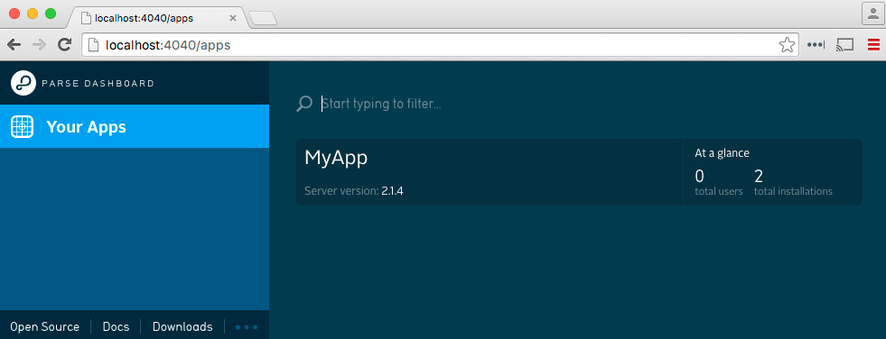

# Parse Dashboard

[](https://greenkeeper.io/)

[](https://travis-ci.org/parse-community/parse-dashboard)
[](https://www.npmjs.com/package/parse-dashboard)

Parse Dashboard is a standalone dashboard for managing your Parse apps. You can use it to manage your [Parse Server](https://github.com/ParsePlatform/parse-server) apps and your apps that are running on [Parse.com](https://Parse.com).

* [Getting Started](#getting-started)
* [Local Installation](#local-installation)
  * [Configuring Parse Dashboard](#configuring-parse-dashboard)
    * [File](#file)
    * [Environment variables](#environment-variables)
      * [Multiple apps](#multiple-apps)
      * [Single app](#single-app)
  * [Managing Multiple Apps](#managing-multiple-apps)
  * [App Icon Configuration](#app-icon-configuration)
  * [App Background Color Configuration](#app-background-color-configuration)
  * [Other Configuration Options](#other-configuration-options)
* [Running as Express Middleware](#running-as-express-middleware)
* [Deploying Parse Dashboard](#deploying-parse-dashboard)
  * [Preparing for Deployment](#preparing-for-deployment)
  * [Security Considerations](#security-considerations)
    * [Configuring Basic Authentication](#configuring-basic-authentication)
    * [Separating App Access Based on User Identity](#separating-app-access-based-on-user-identity)
  * [Use Read-Only masterKey](#use-read-only-masterKey)
    * [Making an app read-only for all users](#making-an-app-read-only-for-all-users)
    * [Makings users read-only](#makings-users-read-only)
    * [Making user's apps readOnly](#making-users-apps-readonly)
  * [Configuring Localized Push Notifications](#configuring-localized-push-notifications)
  * [Run with Docker](#run-with-docker)
* [Contributing](#contributing)

# Getting Started

[Node.js](https://nodejs.org) version >= 4.3 is required to run the dashboard. You also need to be using Parse Server version 2.1.4 or higher.

# Local Installation

Install the dashboard from `npm`.

```
npm install -g parse-dashboard
```

You can launch the dashboard for an app with a single command by supplying an app ID, master key, URL, and name like this:

```
parse-dashboard --appId yourAppId --masterKey yourMasterKey --serverURL "https://example.com/parse" --appName optionalName
```

You may set the host, port and mount path by supplying the `--host`, `--port` and `--mountPath` options to parse-dashboard. You can use anything you want as the app name, or leave it out in which case the app ID will be used.

After starting the dashboard, you can visit http://localhost:4040 in your browser:



## Configuring Parse Dashboard

### File

You can also start the dashboard from the command line with a config file.  To do this, create a new file called `parse-dashboard-config.json` inside your local Parse Dashboard directory hierarchy.  The file should match the following format:

```json
{
  "apps": [
    {
      "serverURL": "http://localhost:1337/parse",
      "appId": "myAppId",
      "masterKey": "myMasterKey",
      "appName": "MyApp"
    }
  ]
}
```

You can then start the dashboard using `parse-dashboard --config parse-dashboard-config.json`.

### Environment variables

> This only works when starting the app using the `parse-dashboard` command

There are also two methods you can use to configure the dashboard using environment variables.

#### Multiple apps

Provide the entire JSON configuration in `PARSE_DASHBOARD_CONFIG` and it will be parsed just like the config file.

#### Single app

You can also define each configuration option individually.

```
HOST: "0.0.0.0"
PORT: "4040"
MOUNT_PATH: "/"
PARSE_DASHBOARD_TRUST_PROXY: undefined // Or "1" to trust connection info from a proxy's X-Forwarded-* headers
PARSE_DASHBOARD_SERVER_URL: "http://localhost:1337/parse"
PARSE_DASHBOARD_MASTER_KEY: "myMasterKey"
PARSE_DASHBOARD_APP_ID: "myAppId"
PARSE_DASHBOARD_APP_NAME: "MyApp"
PARSE_DASHBOARD_USER_ID: "user1"
PARSE_DASHBOARD_USER_PASSWORD: "pass"
PARSE_DASHBOARD_SSL_KEY: "sslKey"
PARSE_DASHBOARD_SSL_CERT: "sslCert"
PARSE_DASHBOARD_CONFIG: undefined // Only for reference, it must not exist
```

## Managing Multiple Apps

Managing multiple apps from the same dashboard is also possible.  Simply add additional entries into the `parse-dashboard-config.json` file's `"apps"` array.

You can manage self-hosted [Parse Server](https://github.com/ParsePlatform/parse-server) apps, *and* apps that are hosted on [Parse.com](http://parse.com/) from the same dashboard. In your config file, you will need to add the `restKey` and `javascriptKey` as well as the other paramaters, which you can find on `dashboard.parse.com`. Set the serverURL to `http://api.parse.com/1`:

```json
{
  "apps": [
    {
      "serverURL": "https://api.parse.com/1", // Hosted on Parse.com
      "appId": "myAppId",
      "masterKey": "myMasterKey",
      "javascriptKey": "myJavascriptKey",
      "restKey": "myRestKey",
      "appName": "My Parse.Com App",
      "production": true
    },
    {
      "serverURL": "http://localhost:1337/parse", // Self-hosted Parse Server
      "appId": "myAppId",
      "masterKey": "myMasterKey",
      "appName": "My Parse Server App"
    }
  ]
}
```

## App Icon Configuration

Parse Dashboard supports adding an optional icon for each app, so you can identify them easier in the list. To do so, you *must* use the configuration file, define an `iconsFolder` in it, and define the `iconName` parameter for each app (including the extension). The path of the `iconsFolder` is relative to the configuration file. If you have installed ParseDashboard globally you need to use the full path as value for the `iconsFolder`. To visualize what it means, in the following example `icons` is a directory located under the same directory as the configuration file:

```json
{
  "apps": [
    {
      "serverURL": "http://localhost:1337/parse",
      "appId": "myAppId",
      "masterKey": "myMasterKey",
      "appName": "My Parse Server App",
      "iconName": "MyAppIcon.png",
    }
  ],
  "iconsFolder": "icons"
}
```

## App Background Color Configuration

Parse Dashboard supports adding an optional background color for each app, so you can identify them easier in the list. To do so, you *must* use the configuration file, define an `primaryBackgroundColor` and `secondaryBackgroundColor` in it, parameter for each app. It is `CSS style`. To visualize what it means, in the following example `backgroundColor` is a configuration file:

```json
{
  "apps": [
    {
      "serverURL": "http://localhost:1337/parse",
      "appId": "myAppId",
      "masterKey": "myMasterKey",
      "appName": "My Parse Server App",
      "primaryBackgroundColor": "#FFA500", // Orange
      "secondaryBackgroundColor": "#FF4500" // OrangeRed
    },
    {
      "serverURL": "http://localhost:1337/parse",
      "appId": "myAppId",
      "masterKey": "myMasterKey",
      "appName": "My Parse Server App [2]",
      "primaryBackgroundColor": "rgb(255, 0, 0)", // Red
      "secondaryBackgroundColor": "rgb(204, 0, 0)" // DarkRed
    }
  ]
}
```

## Other Configuration Options

You can set `appNameForURL` in the config file for each app to control the url of your app within the dashboard. This can make it easier to use bookmarks or share links on your dashboard.

To change the app to production, simply set `production` to `true` in your config file. The default value is false if not specified.

# Running as Express Middleware

Instead of starting Parse Dashboard with the CLI, you can also run it as an [express](https://github.com/expressjs/express) middleware.

```javascript
var express = require('express');
var ParseDashboard = require('parse-dashboard');

var dashboard = new ParseDashboard({
  "apps": [
    {
      "serverURL": "http://localhost:1337/parse",
      "appId": "myAppId",
      "masterKey": "myMasterKey",
      "appName": "MyApp"
    }
  ]
});

var app = express();

// make the Parse Dashboard available at /dashboard
app.use('/dashboard', dashboard);

var httpServer = require('http').createServer(app);
httpServer.listen(4040);
```

If you want to run both [Parse Server](https://github.com/ParsePlatform/parse-server) and Parse Dashboard on the same server/port, you can run them both as express middleware:

```javascript
var express = require('express');
var ParseServer = require('parse-server').ParseServer;
var ParseDashboard = require('parse-dashboard');

var api = new ParseServer({
	// Parse Server settings
});

var options = { allowInsecureHTTP: false };

var dashboard = new ParseDashboard({
	// Parse Dashboard settings
}, options);

var app = express();

// make the Parse Server available at /parse
app.use('/parse', api);

// make the Parse Dashboard available at /dashboard
app.use('/dashboard', dashboard);

var httpServer = require('http').createServer(app);
httpServer.listen(4040);
```

# Deploying Parse Dashboard

## Preparing for Deployment

Make sure the server URLs for your apps can be accessed by your browser. If you are deploying the dashboard, then `localhost` urls will not work.

## Security Considerations
In order to securely deploy the dashboard without leaking your apps master key, you will need to use HTTPS and Basic Authentication.

The deployed dashboard detects if you are using a secure connection. If you are deploying the dashboard behind a load balancer or front-facing proxy, then the app won't be able to detect that the connection is secure. In this case, you can start the dashboard with the `--trustProxy=1` option (or set the PARSE_DASHBOARD_TRUST_PROXY config var to 1) to rely on the X-Forwarded-* headers for the client's connection security.  This is useful for hosting on services like Heroku, where you can trust the provided proxy headers to correctly determine whether you're using HTTP or HTTPS.  You can also turn on this setting when using the dashboard as [express](https://github.com/expressjs/express) middleware:

```javascript
var trustProxy = true;
var dashboard = new ParseDashboard({
  "apps": [
    {
      "serverURL": "http://localhost:1337/parse",
      "appId": "myAppId",
      "masterKey": "myMasterKey",
      "appName": "MyApp"
    }
  ],
  "trustProxy": 1
});
```


### Configuring Basic Authentication
You can configure your dashboard for Basic Authentication by adding usernames and passwords your `parse-dashboard-config.json` configuration file:

```json
{
  "apps": [{"...": "..."}],
  "users": [
    {
      "user":"user1",
      "pass":"pass"
    },
    {
      "user":"user2",
      "pass":"pass"
    }
  ],
  "useEncryptedPasswords": true | false
}
```

You can store the password in either `plain text` or `bcrypt` formats. To use the `bcrypt` format, you must set the config `useEncryptedPasswords` parameter to `true`.
You can encrypt the password using any online bcrypt tool e.g. [https://www.bcrypt-generator.com](https://www.bcrypt-generator.com).

### Separating App Access Based on User Identity
If you have configured your dashboard to manage multiple applications, you can restrict the management of apps based on user identity.

To do so, update your `parse-dashboard-config.json` configuration file to match the following format:

```json
{
  "apps": [{"...": "..."}],
  "users": [
     {
       "user":"user1",
       "pass":"pass1",
       "apps": [{"appId": "myAppId1"}, {"appId": "myAppId2"}]
     },
     {
       "user":"user2",
       "pass":"pass2",
       "apps": [{"appId": "myAppId1"}]
     }  ]
}
```
The effect of such a configuration is as follows:

When `user1` logs in, he/she will be able to manage `myAppId1` and `myAppId2` from the dashboard.

When *`user2`*  logs in, he/she will only be able to manage *`myAppId1`* from the dashboard.

## Use Read-Only masterKey

Starting parse-server 2.6.5, it is possible to provide a `readOnlyMasterKey` to parse-server to prevent mutations on objects from a client.
If you want to protect your dashboard with this feature, just use the `readOnlyMasterKey` instead of the `masterKey`. All write calls will fail.

### Making an app read-only for all users

Start your `parse-server` with

```json
{
"masterKey": "YOUR_MASTER_KEY_HERE",
"readOnlyMasterKey": "YOUR_READ_ONLY_MASTER_KEY",
}
```

Then in your dashboard configuration:

```javascript
var trustProxy = true;
var dashboard = new ParseDashboard({
  "apps": [
    {
      "serverURL": "http://localhost:1337/parse",
      "appId": "myAppId",
      "masterKey": "YOUR_READ_ONLY_MASTER_KEY",
      "appName": "MyApp"
    }
  ],
  "trustProxy": 1
});
```

### Makings users read-only

Make sure you specify the `readOnlyMasterKey` for the apps that you want to use read-only feature in "apps" configuration.
You can mark a user as a read-only user:

```json
{
  "apps": [
    {
      "appId": "myAppId1",
      "masterKey": "myMasterKey1",
      "readOnlyMasterKey": "myReadOnlyMasterKey1",
      "serverURL": "myURL1",      
      "port": 4040,
      "production": true
    },
    {
      "appId": "myAppId2",
      "masterKey": "myMasterKey2",
      "readOnlyMasterKey": "myReadOnlyMasterKey2",
      "serverURL": "myURL2",      
      "port": 4041,
      "production": true
    }
  ],
  "users": [
    {
      "user":"user1",
      "pass":"pass1",
      "readOnly": true,
      "apps": [{"appId": "myAppId1"}, {"appId": "myAppId2"}]
    },
    {
      "user":"user2",
      "pass":"pass2",
      "apps": [{"appId": "myAppId1"}]
    }
  ]
}
```

This way `user1` will have a readOnly access to `myAppId1` and `myAppId2`

### Making user's apps readOnly

Make sure you specify the `readOnlyMasterKey` for the apps that you want to use read-only feature in "apps" configuration.
You can give read only access to a user on a per-app basis:

```json
{
  "apps": [
    {
      "appId": "myAppId1",
      "masterKey": "myMasterKey1",
      "readOnlyMasterKey": "myReadOnlyMasterKey1",
      "serverURL": "myURL",      
      "port": 4040,
      "production": true
    },
    {"...": "..."}
  ],
  "users": [
    {
      "user":"user",
      "pass":"pass",
      "apps": [{"appId": "myAppId", "readOnly": true}, {"appId": "myAppId2"}]
    }
  ]
}
```

With this configuration, user1 will have read only access to `myAppId1` and read/write access to `myAppId2`.

## Configuring Localized Push Notifications

With the latest version of the [dashboard](https://www.npmjs.com/package/parse-dashboard), it is possible to send localized messages for push notifications.
You can provide a list of locales or languages you want to support for your dashboard users.

```json
{
  "apps": [
    {
      "serverURL": "http://localhost:1337/parse",
      "appId": "myAppId",
      "masterKey": "myMasterKey",
      "appName": "My Parse Server App",
      "iconName": "MyAppIcon.png",
      "supportedPushLocales": ["en", "ru", "fr"]
    }
  ],
  "iconsFolder": "icons"
}
```

## Run with Docker

It is easy to use it with Docker. First build the image:

```
docker build -t parse-dashboard .
```

Run the image with your ``config.json`` mounted as a volume

```
docker run -d -p 8080:4040 -v host/path/to/config.json:/src/Parse-Dashboard/parse-dashboard-config.json parse-dashboard
```

By default, the container will start the app at port 4040 inside the container. However, you can run custom command as well (see ``Deploying in production`` for custom setup).

In this example, we want to run the application in production mode at port 80 of the host machine.

```
docker run -d -p 80:8080 -v host/path/to/config.json:/src/Parse-Dashboard/parse-dashboard-config.json parse-dashboard --port 8080
```

If you are not familiar with Docker, ``--port 8080`` will be passed in as argument to the entrypoint to form the full command ``npm start -- --port 8080``. The application will start at port 8080 inside the container and port ``8080`` will be mounted to port ``80`` on your host machine.

# Contributing

We really want Parse to be yours, to see it grow and thrive in the open source community. Please see the [Contributing to Parse Dashboard guide](CONTRIBUTING.md).

-----

As of April 5, 2017, Parse, LLC has transferred this code to the parse-community organization, and will no longer be contributing to or distributing this code.
